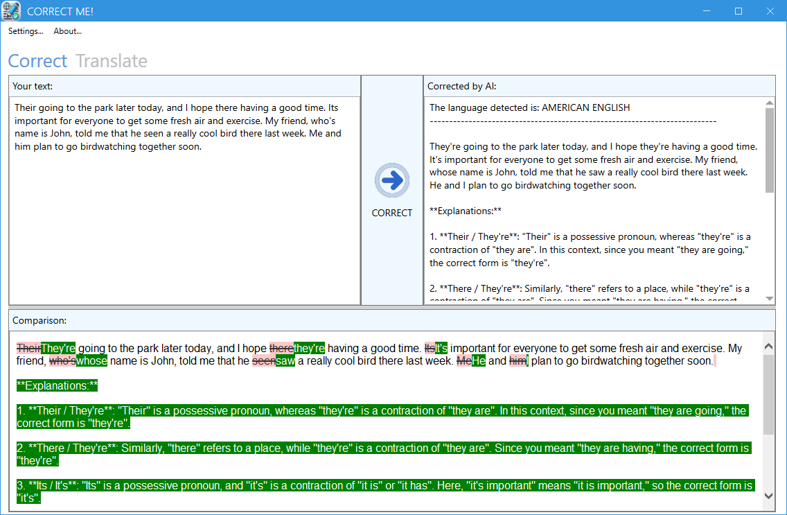

# Correct Me!
**Correct Me!** is a simple Windows application that helps users use AI to correct their written texts in any language. Just put your text in and press CORRECT, and your text will be corrected with detailed explanations of all the corrections made. The AI will automatically detect the language you put it in. This tool uses ChatGPT 4o as the AI corrector.

On the right, you can see the corrections and explanations generated by the AI in real-time. At the end, the corrections will be shown in the bottom field with the corrections highlighted for better comprehension of the corrections made.

**IMPORTANT!** In order for this app to be able to use ChatGPT 4o, you must enter your ChatGPT API key with sufficient credits to make requests to OpenAI APIs. Refer to OpenAI help pages to find information on how to generate your API Keys: https://help.openai.com/en/articles/4936850-where-do-i-find-my-openai-api-key

You can also use this app to translate texts as well. Input your text and choose the language to translate to from the upper right language list.

This application is made for Microsoft Windows and requires .NET Framework 4.8. The project includes an installer that is built when the solution is in Release mode. The installer will install .NET Framework 4.8 if necessary.

Download it from Github releases - https://github.com/fabiojbg/Correct-Me/releases

